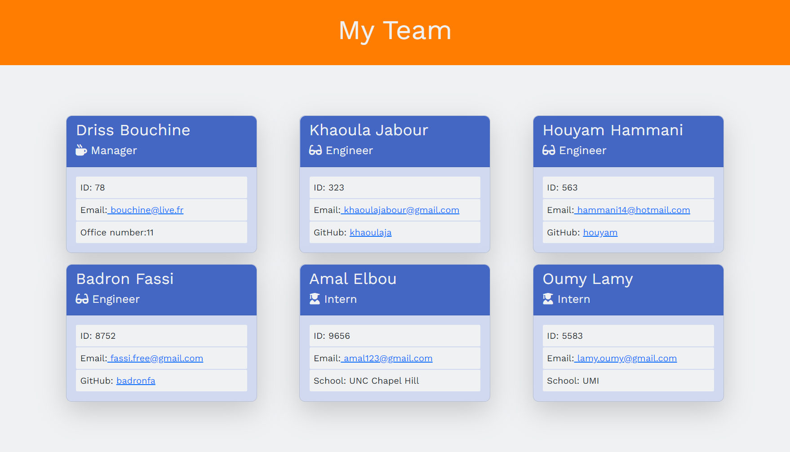

# Team-Profile-Builder

  ## Description 

  This is a command-line application that takes in information about employees on a software engineering team and generates an HTML webpage that displays summaries for each person.   

  

  ## Installation
  
  To install the dependencies run this command :   npm install
  
  ## Usage 

   To use this application run :   node index.js   
   For a demonstration about how to generate the team profile visit the [walkthrough video](https://drive.google.com/file/d/17Jzf6GFXDn5bA5qvKL1vhPDTWY4otcdn/view)

 ## Tests

  Run the following command for tests :   npm run test

  ## License

  This work is licensed under [MIT License](https://opensource.org/licenses/MIT). 
  Made with ❤ by Khaoula Jabour  
  &copy; 2021 Team-Profile-Builder

